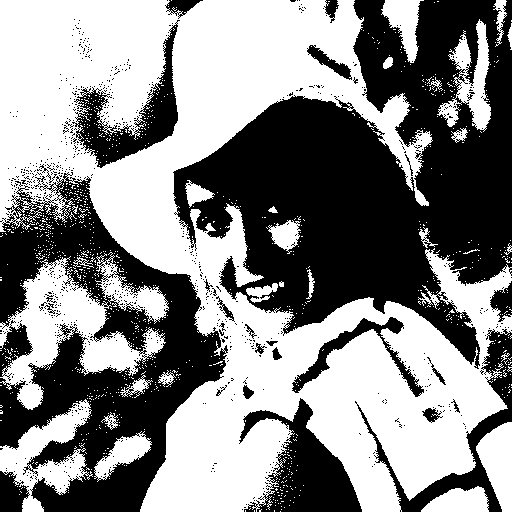

# 第三次作业 直方图增强
*彭相阳 自动化钱61 2160800060*
*2019.03.18*
## 1.画出直方图

## 2.直方图均衡
从下面一系列的经过直方图均衡处理的前后对比中，我们可以发现，直方图均衡可以造成对比度增强的效果。  
citywall系列：  
  
elain系列  
  
lena系列  
  
woman系列  

## 3.直方图匹配
以citywall为模板对citywall2进行直方图匹配：  
  
以elain为模板对elain3进行直方图匹配：  
  
以lena为模板对lena4进行直方图匹配：  
  
以woman为模板对woman2进行直方图匹配：  

## 4.局部直方图增强
局部直方图均衡可以增强图像中小区域的细节，但同时也会增强噪声。  

## 5.直方图分割
